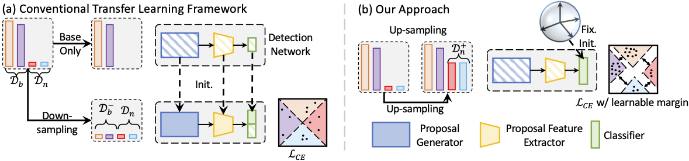

# DiGeo: Discriminative Geometry-Aware Learning for Generalized Few-Shot Object Detection
[](https://lgtm.com/projects/g/ucbdrive/few-shot-object-detection/context:python)
[](https://github.com/psf/black)
[](https://github.com/pre-commit/pre-commit)

DiGeo contains the official generalized few-shot object detection implementation of the CVPR 2023 paper
[DiGeo: Discriminative Geometry-Aware Learning for Generalized Few-Shot Object Detection](https://arxiv.org/abs/2212.13738).

## Overview

Generalized few-shot object detection aims to achieve precise detection on both base classes with abundant annotations and novel classes with limited training data. However, existing approaches enhance few-shot generalization with the sacrifice of base-class performance, or maintain high precision in base-class detection with limited improvement in novel-class adaptation. In this project, we point out the poor balance between base knowledge preservation and novel knowledge adaptation of existing (G)FSOD approaches. We highlight the reason is that the extracted features are not discriminative enough for all classes and highlight the weakness of existing training pipeline. As such, we propose a new training framework, DiGeo, to learn Geometry-aware features of inter-class separation and intra-class compactness.




(a) Conventional approaches ([TFA]()) first pre-train a base detector among the base set and then finetune on the union of novel set and down-sampled subset of base classes. We experimentally found out that aggressively downsampling the base set is necessary for few-shot adaptation since it is important to learn a well-separated classifier. However, it inevitably ignore the diversity of training samples of novel classes. (b) Instead, we choose to up-sample and directly train the detector on the full set. To guide the separation of feature clusters, we derive an offline simplex equiangular tight frame (ETF) classifier whose weights serve as class centers and are maximally and equally separated. To tighten the cluster for each class, we include adaptive class-specific margins into the classification loss and encourage the features close to the class centers. The margins are estimated from priors of instance distribution and learned though self-distillation. The block with shading means training from scratch.

If you find this repository useful for your publications, please consider citing our paper.

```angular2html
@InProceedings{Ma_2023_CVPR,
    author    = {Ma, Jiawei and Niu, Yulei and Xu, Jincheng and Huang, Shiyuan and Han, Guangxing and Chang, Shih-Fu},
    title     = {Few-Shot Object Detection With Fully Cross-Transformer},
    booktitle = {Proceedings of the IEEE/CVF Conference on Computer Vision and Pattern Recognition (CVPR)},
    month     = {June},
    year      = {2023},
}
```


## Updates
- (March 2023) The code has been released.
- (March 2023) The checkpoints on Pascal VOC and MS COCO has been [published](https://drive.google.com/drive/folders/1w4tcRiiqYL9Z80lYBQOuNQhZGUl0v4l_?usp=share_link).

## Instillation

Our code is developped based upon [TFA](https://github.com/ucbdrive/few-shot-object-detection) and please follow their instructions for library (pytorch, detectron2) installization and dataset preparation.
- For the library/package used for running the code, the repo has been verified on Pytorch 1.7~1.10. For the instillation of detectron2, we install the pre-compiled version following the instructions [here](https://detectron2.readthedocs.io/en/latest/tutorials/install.html).
- For the dataset preparation, we would recommend to organize the data in a shared storage server in your own GPU clusters (if applicable) and then crerate a soft link towards the root with the destination as 'datasets'.

Finally, the code structure should look like 

- **configs**: Configuration files
- **datasets**: 
- **checkpoints**: 
- **fsdet**
  - **checkpoint**: Checkpoint code.
  - **config**: Configuration code and default configurations.
  - **data**: Build meta-data of dataset split such that they can be directly called in the experiment configuration files.
  - **engine**: Contains training and evaluation loops and hooks.
  - **evaluation**: Evaluator for different datasets.
  - **modeling**: Code for models, including backbones, proposal networks, and prediction heads.
- **scripts**: Commands for running the code
- **tools**
  - **train_net.py**: Training script.
  - **test_net.py**: Testing script.
  - **ckpt_clean.py**: Surgery on checkpoints (remove confusing hyper-parameters such as iterations).


## Getting Started

Our framework consists of two steps. We first pre-train the detector with fixed margin (i.e., Prior) and then perform self-distillation to adaptively adjust the margins. 

### Pre-Training (Prior) with Command Line

To pre-train a model, select the right config under ``configs`` which has the keyword `pre` in the filename. For your convenience, you can run the code in the sh file by 
```angular2html
sh scripts/prior.sh
```

The checkpoints of pre-training can be found [here](https://drive.google.com/drive/folders/1w4tcRiiqYL9Z80lYBQOuNQhZGUl0v4l_?usp=share_link).  We hope our checkpoints can be used as initialization for the future development. To skip the pre-training step, you can directly download the linked folder at the root of this repo and make sure to rename the downloaded folder as `checkpoints`. 

### Prepare the checkpoints for self-distillation stage 

After pre-training, it is needed to clean the saved checkpoints to be used for the self-distillation stage. The command is 
```angular2html
python tools/ckpt_clean.py
```

### Self-Distillation Stage with Command Line

To perform the distillation stage, simply run 
```angular2html
sh scripts/distill.sh
```
To note, the configuration of distillation inherites the corresponding configuration of pre-training, in particular, the parameters for loss calculation and for ckpt loading & initialization.

## Inference Demo with Pre-trained Models

The pre-trained checkpoints can be found in `Demo` under [here](https://drive.google.com/drive/folders/1w4tcRiiqYL9Z80lYBQOuNQhZGUl0v4l_?usp=share_link). Please put it under `checkpoints/${dataset}/distill`.

The testing command is provided in an sh file and please run
```angular2html
sh scripts/demo.sh
```